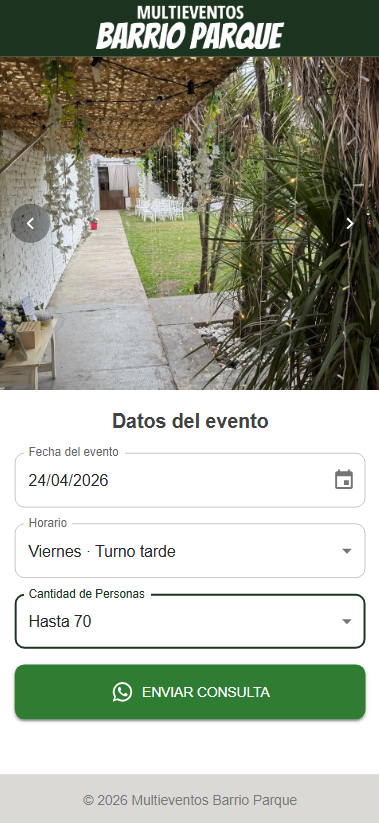

# 🎉 Multieventos Barrio Parque Calchaqui

Sistema web para consulta y pre-reserva de un salón de eventos mediante selección de fecha, horario y cantidad de personas, con integración directa a WhatsApp para finalizar la solicitud.

La aplicación fue desarrollada para uso real, siendo utilizada por los responsables del salón para agilizar y organizar las consultas de clientes.

El proyecto incluye Frontend Web + lógica de negocio en cliente + integración con servicios externos.

---

## 📄 Descripción

Se desarrolló una interfaz web que permite a los usuarios:

- Seleccionar una fecha disponible (desde el día actual en adelante)
- Visualizar horarios disponibles según el día elegido
- Elegir la cantidad de personas para el evento
- Generar automáticamente un mensaje estructurado
- Redirigir la consulta a WhatsApp

La aplicación permite manejar múltiples contactos, generando enlaces hacia distintos números de WhatsApp según corresponda, facilitando la gestión entre diferentes responsables del salón.

La aplicación es **100% responsive** y pero esta optimizada para uso en dispositivos móviles.

---

## 🛠️ Tecnologías utilizadas

### Frontend

- **React (Vite)**
- **Material UI (MUI)**
- **JavaScript**

### Integraciones

- **WhatsApp API (wa.me)** para generación de consultas automáticas

El código sigue buenas prácticas de organización, separando componentes, constantes y lógica, facilitando la escalabilidad y mantenimiento.

---

## 📷 Preview



---

## ⚙️ Funcionamiento

El usuario completa:

- 📅 Fecha
- 🕒 Horario
- 👥 Cantidad de personas

Y la aplicación genera automáticamente un mensaje como:

```text
Hola! Quisiera consultar por el salón Multieventos BP.
- Fecha: Sábado 12/04/2026
- Horario: 16:00 - 20:00
- Cantidad: Hasta 50 personas
```

## 🌐 Deploy

https://multieventosbp.vercel.app/
